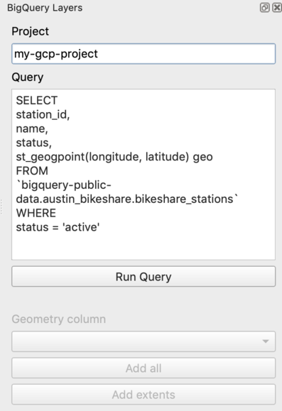

# bigquerylayers 
QGIS plugin for importing data from BigQuery

## Install
1. Create a project using the [Google Cloud Console](https://console.cloud.google.com)
2. Install the Google Cloud SDK and authenticate using the command  `gcloud auth application-default login`
3. Install the BigQuery layers plugin using the QGIS plugin manager

## Development
1. Make sure you have an active GCP project and authenticated Google Cloud SDK
2. Clone this repo and symlink it to the QGIS plugins folder

*  Mac: `ln -s ${PWD} ~/Library/"Application Support"/QGIS/QGIS3/profiles/default/python/plugins`

## Updating bundled BigQuery libs
`pip install --target bqloader/libs google-cloud-bigquery --upgrade` 
